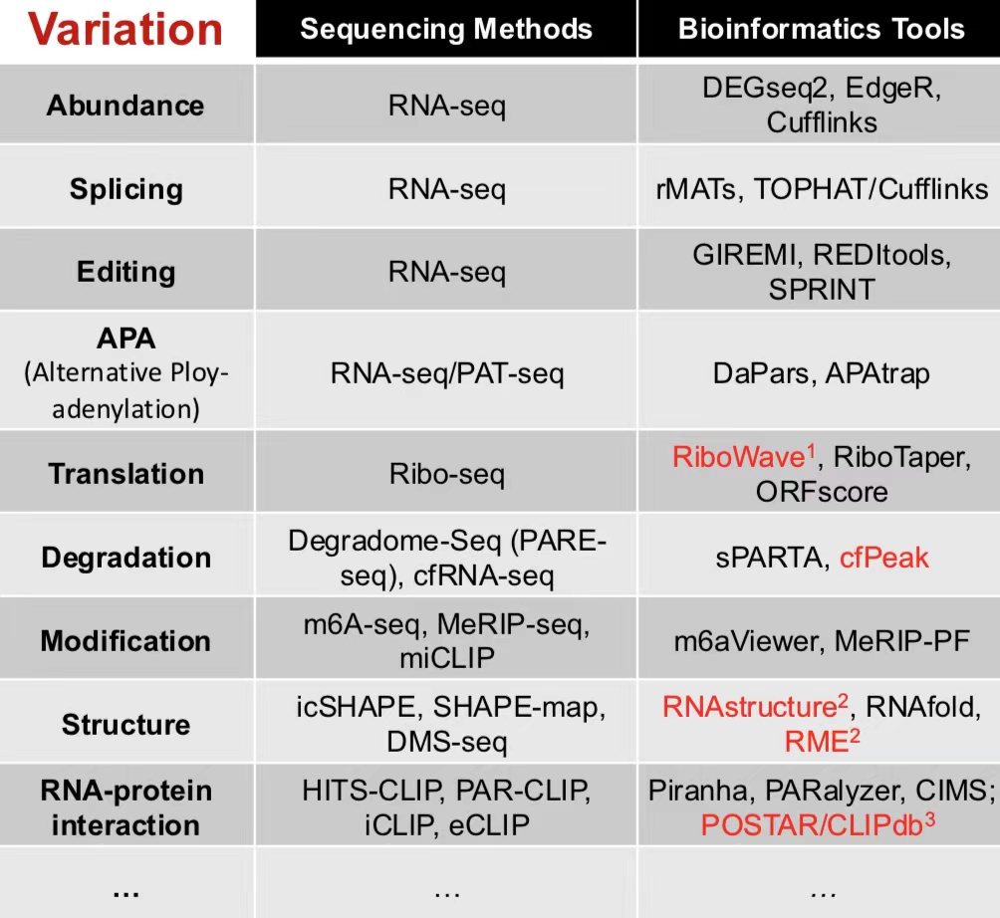
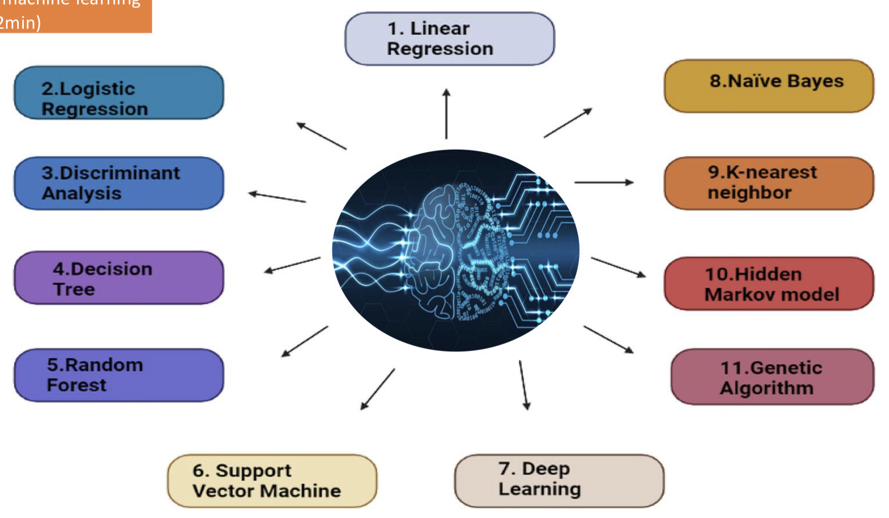
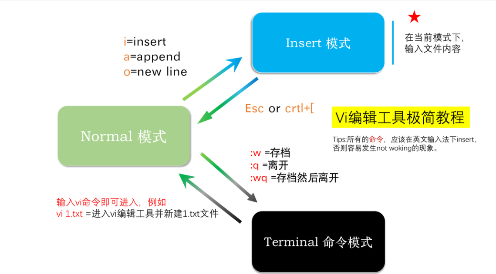
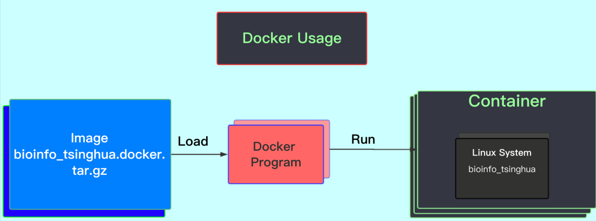

# 生物信息学实践 9.13
## Course Logistic
### 预修课程
微积分、概率论、物化......
### 后续课程
Python相关、AI相关
### 学习内容和方法
#### 参考资料
- 主要：
  - [上课讲义](https://cloud.tsinghua.edu.cn/d/7b9e077b79a94f82b2d7/)
  - [实践教程](https://book.ncrnalab.org/teaching)
- 其他：
  - 参考书
  - 在线搜索
  - 在线课程
#### 学习内容
- Linux(week1-4)
- R/Python(week5-16)
#### 学习方法
- In-class + After-class
- 构建学习和实践的框架
- 自主学习编程技巧（**Bioinformatics Data Skills**）
### 评分机制
- 20%课堂互动
- 80%作业（建议和反馈加分）
- 加分题（学期末）
### 答疑时间
课前（教师）课后（助教）
## Introduction of Bioinformatics
### 4 steps
**Question->Information->Analysis->Modeling** 
### Question(问题)
Science? Technology? Philosophy?
### Information(信息)
**NGS(Next Generation Sequecing)**: 测序能力革命性的提升
> **1**(HGP)->**4,000,000,000** per year
> 
> **Big** and **HD** data
> 
> **Metagenomic**
  1. DNA-seq
  2. RNA-seq
  3. Epigenetics
     - DNAase
     - Methylation
     - Histone modifications: ChIP-seq
  4. Interaction
     - ChIP-seq(*Protein-DNA*)
     - CLIP-seq(*Protein-RNA*)
     - Grid-seq(*DNA-RNA*)
### Analysis(分析)
- Sequecing method + bioinformatics tool
> Different RNA variations should match different sequencing methods and bioinformatics tools
>
> 
- Data interpretation
> Cell types/Gene signatures
### Modeling(建模)
#### Probabilistic Model（模型）
- Machine learning
  -Regression (回归)
  > Linear regression -> Logistic regression
- Deep learning (深度学习)
  > Neural network model
- ......
  > 

#### Computational Algorithm（算法）
不同于通过数据进行预测的模型（model），算法（algorithm）是一套固定的计算（computational）方法，是**定义明确**的程序或指令。而模型则是基于学习算法进行构建和输出的，进行预测的程序。如：Number sorting(排序), Dynamic programming(动态规划), ...
### Two Types of Bioinformatics Studies
- **Data problem**
  > 作图、数据存储、分析方法......
- **Biology problem**
  > 序列分析、结构预测......
### The 4th Paradigm--第四研究范式
Big data-driven science
 - Big data, machine learning
 - Patterns, anomalies
 - Visualization
## Getting Started
### 工作记录（Document）
- GitHub
  - 源代码托管平台
  - 可以创建自己的仓库（Repositories），添加**README.md**
  - 网址[https://github.com](https://github.com)
- Markdown
  - 通用标记语言，语法简洁
  - Linux系统自带，可用于编写README.md文件
  - md文件可以生成PDF、HTML等
### 工作备份（Backup）
- 云存储
  > **清华云**或其他商业云存储
- 系统自带
- GitHub
### 实践教程（Tutorial）
- 练习文件&视频[Teaching Materials](https://book.ncrnalab.org/teaching/appendix/appendix-iv.-teaching)
- 更多资料[Others](https://book.ncrnalab.org/teaching/appendix/appendix1.keep-learning)
### 软件设置&安装（Setup）
#### 文本编辑（Text editor）
  - VS code
  - Vim
    > Linux系统自带，常用
    > 
    > 可以依靠**键盘**完成各种操作
    > 
    > 模式切换：
    > 
    > 
#### Setup Docker
  - Docker：轻量级虚拟机
    - image：创建虚拟机的模板
    - container：虚拟机
      > 
  - Docker安装和运行[install and use docker in windows](https://book.ncrnalab.org/teaching/getting-started/docker#id-2-install-and-use-docker-in-windows)
# 生物信息学学习计划
## 总体目标
- **Linux**：熟悉Linux系统，确保可以使用Linux系统完成日常操作和一些相关软件使用
- **R**：掌握用R进行数据处理和作图的方法
- **Python**：进一步了解字符串处理、文件处理、机器学习等相关算法
- **数据分析**：重点熟悉了解不同测序数据（特别是单细胞测序）的后续处理流程
## 大体规划
- **课上**：认真听课，尤其是**实例演示**
- **实践**：课后作业+实验数据简单处理
- **其他**：线上相关资源+**测序分析文献结果复现**
## 每周投入时间：1.5h（课上）+1-2h（作业）+3-4h（其他实践内容）、
